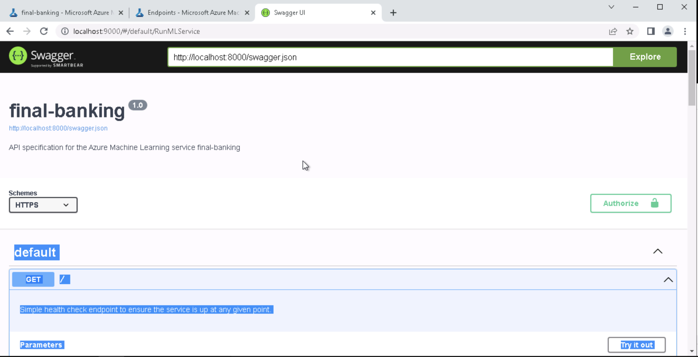
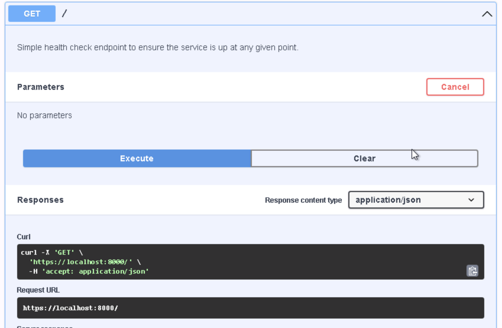

*NOTE:* This file is a template that you can use to create the README for your project. The *TODO* comments below will highlight the information you should be sure to include.

# ML Ops ML Engineer Udacity Project 

After the AutoML run, which we run on an instantiated compute cluster, we select the best model and deploy it in an azure container instance to provide it to the enduser as an API endpoint which either another service or a human can consume.

## Architectural Diagram

## Key Steps
*TODO*: Write a short discription of the key steps. Remeber to include all the screenshots required to demonstrate key steps. 

(Note: Please note screenshots sometimes relate to an independent run as I did not redo all the screenshots after once comleting half the project.)

Several steps that are important to provide the model results to endusers are taken:

1. Setup AutoML experiment run and dataset.

2. Providing documentation via Swagger UI, to help the endconsumer use the API.

3. Logging to inform about any abnormalities like e.g. server errors due to timeouts or internal server errors depending on the error code. Logging helps to identify any problems with the deployed model.

4. Testing the endpoint by querying the HTTP endpoint over which the responses are provided to the user.
Testing involves both load testing i.e. how many queries can my service handle but also unit testing e.g. sending multiple different queries to the API and check whether the responses are as expected and not e.g. server error occurs while querying the API.

Note: The script provided was met with the following error (list index out of range).
Hence I proceeded to take the provided example python snippet in the consume tab of azure to query the model. Since I work on MACOS copy paste from one file to another within the VM was not possible, hence I did not proceed to rewrite the entire json values to match the original query! (explained also in screencast, but could not record Audio!)

5. Publish Pipelines
This helps to make steps reusable and also enables versioning of these steps. Collaboration is facilitated while a pipeline runs in production one can work on improving the pipeline and publish a new version once it is ready. 

## Screen Recording

Could not get audio to be recorded on my system, tried to be vocal about all information in the text.

* 

## Standout Suggestions

Suggestions for improvement:

1. No special improvements have been done on the modelling side, and since we could probably make educated guesses on which models could perform well we could spare some compute resources from being used. Also we should definitely ask stakeholders on their requirements for the performance before publishing the model.
2. The endpoint gives a response even to a nonsensical json hence a better query handling needs to be done.
3. The swagger documentation needs to be hosted non locally to be accessible to the users, and for having full functionality.
